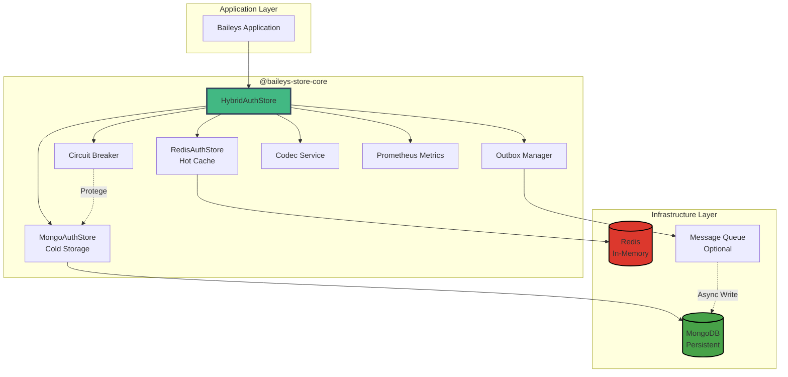

# Arquitetura Geral - Hybrid Storage

Este documento descreve a arquitetura geral do sistema de armazenamento híbrido para Baileys v7.0+.

## Visão Geral do Sistema



## Camadas de Responsabilidade

### Application Layer

- **Baileys Application**: Cliente que utiliza a biblioteca
- Interage apenas com `HybridAuthStore` via hooks (`useHybridAuthState`)

### Core Layer (@baileys-store-core)

- **HybridAuthStore**: Orquestrador principal
  - Decide read/write path (cache hit vs miss)
  - Coordena Redis e MongoDB
  - Gerencia consistency (sync vs async)
- **RedisStore**: Hot cache layer
  - TTL gerenciado
  - Eviction policies
  - Sub-millisecond access
- **MongoStore**: Cold storage layer
  - Durabilidade garantida
  - ACID transactions
  - Backup/recovery
- **Outbox Manager**: Asynchronous consistency
  - Transactional outbox pattern
  - Reconciliation worker
  - Event deduplication

### Infrastructure Layer

- **Redis**: In-memory key-value store
- **MongoDB**: Document database
- **Message Queue**: Optional (BullMQ, Kafka, SQS)

## Fluxo de Dados

### Read Path (Hot Cache)

```
Client → HybridStore → Redis → (Cache Hit) → Return Data
                            ↓
                    (Cache Miss) → MongoDB → Cache Warming → Return Data
```

### Write Path (Sync Mode)

```
Client → HybridStore → Redis → MongoDB → ACK
         (Write-through)
```

### Write Path (Async Mode - Write-Behind)

```
Client → HybridStore → Redis → Outbox → ACK (immediate)
                                        ↓
                                   Background Worker
                                        ↓
                                     MongoDB
```

## Componentes Chave

### Circuit Breaker

- **Estado**: Closed → Open → Half-Open → Closed
- **Trigger**: 50% error rate over 10s
- **Timeout**: 30s before retry
- **Degraded Mode**: Operates with Redis-only

### Outbox Pattern

- **Garantia**: At-least-once delivery
- **Idempotência**: Version-based deduplication
- **Recovery**: Auto-reconciliation every 60s

### Encryption

- **Algoritmo Default**: XSalsa20-Poly1305 (secretbox)
- **Algoritmo Alternativo**: AES-256-GCM
- **Key Rotation**: Configurable (default 90 days)

## Design Patterns Utilizados

1. **Strategy Pattern**: Multiple store implementations (Redis, MongoDB, Hybrid)
2. **Circuit Breaker Pattern**: Fault tolerance for MongoDB
3. **Transactional Outbox Pattern**: Eventual consistency guarantee
4. **Mutex Pattern**: Concurrency control (async-mutex)
5. **Adapter Pattern**: Queue abstraction (BullMQ, Kafka, SQS)

## Capacidade e Escalabilidade

### Fase 1: Single Instance (0-100 sessions)

- 1 Redis + 1 MongoDB
- Custo: $20-40/mês

### Fase 2: High Availability (100-1000 sessions)

- Redis Sentinel + MongoDB Replica Set
- Custo: $150-250/mês

### Fase 3: Horizontal Scaling (1000-5000 sessions)

- Redis Cluster + MongoDB Sharded Cluster
- Custo: $500-800/mês

### Fase 4: Enterprise (5000+ sessions)

- Multi-region deployment
- Custo: $1500-3000/mês

## Métricas e Observabilidade

### Prometheus Metrics (13 métricas)

- Cache hits/misses
- Operation latency (p50, p95, p99)
- Circuit breaker state transitions
- Outbox lag
- Error rates by type

### Health Checks

- `/health` - Overall system health
- `/ready` - Readiness probe
- `/metrics` - Prometheus format

## Segurança

### Encryption

- App-level encryption (optional)
- Master key rotation (90 days default)
- Secure key storage (environment variables)

### Network

- TLS support for Redis/MongoDB connections
- Authentication via credentials

### Data Privacy

- No logging of sensitive data
- Sanitization of credentials in logs
- Access control via session IDs

---

**Próximos Diagramas:**

- [Read Path Detail](./read-path.md)
- [Write Path Detail](./write-path.md)
- [Circuit Breaker States](./circuit-breaker.md)
- [Data Consistency Model](./data-consistency.md)
