# Circuit Breaker States

Diagramas e explicação detalhada dos estados do Circuit Breaker para proteção de resiliência do MongoDB.

## State Diagram

```mermaid
stateDiagram-v2
    [*] --> Closed

    Closed --> Open: Error rate > 50%<br/>within 10s window
    Open --> HalfOpen: 30s timeout elapsed

    HalfOpen --> Closed: Test request succeeds<br/>error rate < 50%
    HalfOpen --> Open: Test request fails<br/>error rate >= 50%

    Closed: CLOSED<br/>✅ MongoDB accessible
    Open: OPEN<br/>⚠️ MongoDB unavailable
    HalfOpen: HALF-OPEN<br/>🔄 Testing recovery
```



## State Transitions Table

| State         | Condition                       | Action                  | Next State |
| ------------- | ------------------------------- | ----------------------- | ---------- |
| **CLOSED**    | Normal operation                | Route to MongoDB        | CLOSED     |
| **CLOSED**    | Error rate > 50% (10s)          | Stop routing to MongoDB | OPEN       |
| **OPEN**      | 30s timeout                     | Allow one test request  | HALF-OPEN  |
| **HALF-OPEN** | Test succeeds, error rate < 50% | Resume normal operation | CLOSED     |
| **HALF-OPEN** | Test fails or error rate >= 50% | Revert to blocking      | OPEN       |

## Detailed Behavior

### CLOSED State ✅

- **Behavior**: All requests routed to MongoDB
- **Metrics**: Track success/failure counts
- **Health**: System fully operational

### OPEN State ⚠️

- **Behavior**: All requests fail-fast immediately
- **Response**: `CircuitBreakerOpenError` without touching MongoDB
- **Duration**: 30 seconds minimum (cooldown period)
- **Graceful Degradation**: Redis-only mode enabled

### HALF-OPEN State 🔄

- **Behavior**: One test request allowed
- **Monitoring**: Track if test succeeds
- **Decision**:
  - Success → CLOSED
  - Failure → OPEN

## Sequence Diagram - Circuit Opening

```mermaid
sequenceDiagram
    participant Client
    participant HybridStore
    participant CircuitBreaker
    participant MongoDB

    loop Normal Operation (CLOSED)
        Client->>HybridStore: get(sessionId)
        HybridStore->>CircuitBreaker: Execute MongoDB operation
        CircuitBreaker->>MongoDB: Query
        MongoDB-->>CircuitBreaker: Success
        CircuitBreaker-->>HybridStore: Result
    end

    Note over CircuitBreaker,MongoDB: Error rate exceeds 50%

    CircuitBreaker-->>HybridStore: State: OPEN
    Client->>HybridStore: get(sessionId)
    HybridStore->>CircuitBreaker: Execute MongoDB operation
    CircuitBreaker-->>HybridStore: CircuitBreakerOpenError
    Note over Client: ✅ Still returns data from Redis
```



## Configuration

### Default Settings

```typescript
const circuitBreakerConfig = {
  errorThresholdPercentage: 50, // 50% error rate
  timeout: 30000, // 30 seconds
  resetTimeout: 30000, // 30 seconds cooldown
  volumeThreshold: 10, // Minimum 10 requests before opening
  rollingCountTimeout: 10000, // 10 second window
  rollingCountBuckets: 5, // 5 buckets (2s each)
};
```

## Impact on Operations

### Read Operations

```mermaid
flowchart TD
    Start[Client Read] --> CheckCB{Circuit Breaker<br/>State?}

    CheckCB -->|CLOSED| Normal[Query MongoDB]
    CheckCB -->|OPEN| Degraded[Redis-only Mode]
    CheckCB -->|HALF-OPEN| Test[Test Request]

    Normal --> FromMongo[Return from MongoDB]
    Degraded --> FromRedis[Return from Redis<br/>⚠️ Potentially Stale]
    Test --> Success{Test<br/>Success?}

    Success -->|Yes| FromMongo
    Success -->|No| Error[Return Error]

    FromMongo --> End[End]
    FromRedis --> End
    Error --> End
```



### Write Operations


## Recovery Strategies

### Automatic Recovery

- **Trigger**: 30s timeout after OPEN state
- **Test**: One request to MongoDB
- **Success Criterion**: Response time < timeout AND no error
- **Resume**: Return to CLOSED state

### Manual Recovery

```typescript
// Manually reset circuit breaker (for testing)
await store.resetCircuitBreaker();
```

## Metrics and Monitoring

### Prometheus Metrics

```
# Circuit breaker state transitions
baileys_circuit_breaker_state_transitions_total{state="open",trigger="error_threshold"} 1
baileys_circuit_breaker_state_transitions_total{state="half-open",trigger="timeout"} 1
baileys_circuit_breaker_state_transitions_total{state="closed",trigger="test_success"} 1

# Circuit breaker error rate
baileys_circuit_breaker_error_rate{window="10s"} 0.42
```

### Grafana Alerts

- **Warning**: Error rate > 30% for 30s
- **Critical**: Circuit breaker OPEN for > 60s

## Degraded Mode Behavior

When circuit breaker is OPEN:

- ✅ **Read operations**: Continue from Redis cache
- ✅ **Write operations**: Persist to Redis, queue for async MongoDB sync
- ⚠️ **Data freshness**: Potential staleness (TTL-dependent)
- ⚠️ **Consistency**: Eventual consistency (via outbox)

### Redis-Only Mode

```
Client → HybridStore → Redis → Return (Cache hit)
                         ↓
                    Cache Miss → Return null (MongoDB unavailable)
```

---

**Próximos Diagramas:**

- [Data Consistency Model](./data-consistency.md)
- [Versioning Strategy](./versioning.md)
