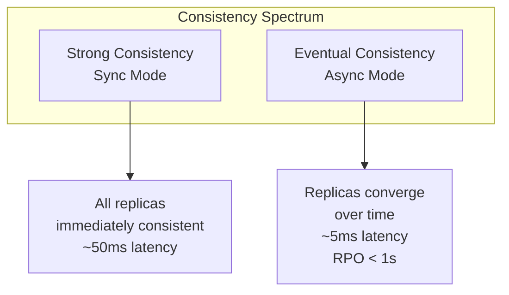
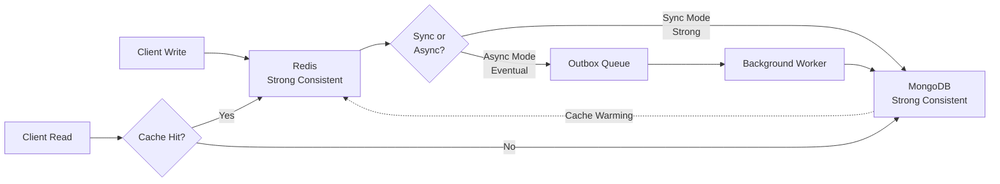
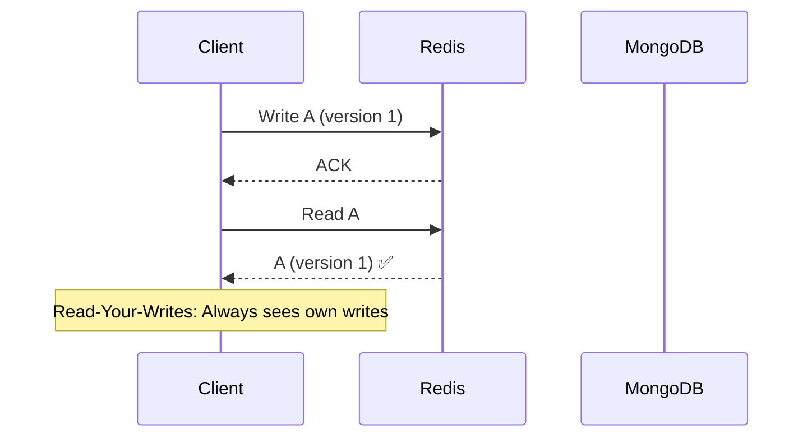
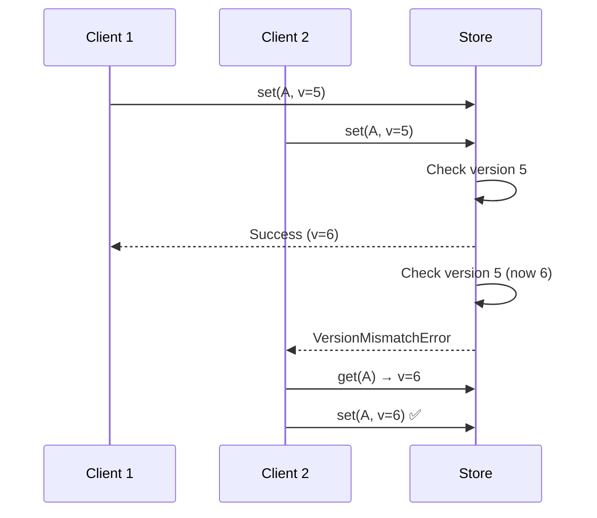
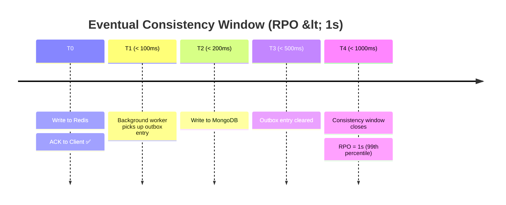
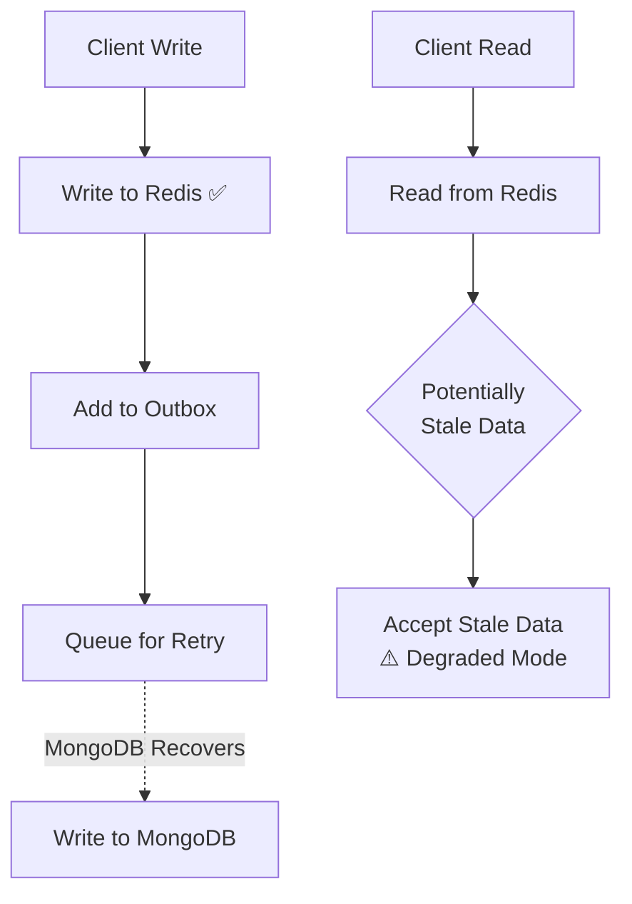

# Data Consistency Model

Modelo de consistência de dados com strong consistency opcional e eventual consistency padrão.

## Consistency Levels



## Consistency Model Comparison



## Trade-offs

| Aspect          | Sync Mode (Strong) | Async Mode (Eventual) |
| --------------- | ------------------ | --------------------- |
| **Latency**     | ~50ms p99          | ~5ms p99              |
| **Consistency** | Strong (ACID)      | Eventual (RPO < 1s)   |
| **Throughput**  | 500 ops/s          | 2000+ ops/s           |
| **Durability**  | Immediate          | Delayed (< 1s)        |
| **Use Case**    | Critical writes    | High-frequency writes |

## Read Consistency

### Read-Your-Writes Guarantee



### Monotonic Reads

- Same client will never see older data after seeing newer data
- Achieved via version-based snapshot isolation

## Write Consistency

### Sync Mode - Strong Consistency

```typescript
// Atomic two-phase write
async set(sessionId, patch, version) {
  // Phase 1: Check version
  const current = await mongo.get(sessionId);
  if (current.version !== version) {
    throw new VersionMismatchError();
  }

  // Phase 2: Write to both stores atomically
  await redis.set(sessionId, { ...current, ...patch, version: version + 1 });
  await mongo.set(sessionId, { ...current, ...patch, version: version + 1 });

  return { version: version + 1 };
}
```

### Async Mode - Eventual Consistency

```typescript
// Write-behind with outbox
async set(sessionId, patch, version) {
  // Phase 1: Immediate write to Redis
  await redis.set(sessionId, { ...current, ...patch, version: version + 1 });

  // Phase 2: Queue for async MongoDB persistence
  await outbox.add({
    sessionId,
    patch,
    version: version + 1,
  });

  return { version: version + 1 }; // Immediate ACK
}
```

## Conflict Resolution

### Optimistic Locking



## Replication Lag Window



## Fallback and Degradation

### MongoDB Unavailable (Circuit Breaker OPEN)



### Consistency Guarantees by Mode

| Mode             | Read Consistency    | Write Durability  | Recovery  |
| ---------------- | ------------------- | ----------------- | --------- |
| **Normal**       | Strong              | Immediate         | Full      |
| **MongoDB Down** | Eventual (stale OK) | Eventual (outbox) | Automatic |
| **Redis Down**   | From MongoDB        | To MongoDB        | Full      |

## Monitoring Consistency

### Key Metrics

```
# Replication lag
baileys_outbox_lag_seconds{quantile="0.99"} 0.95

# Consistency violations
baileys_version_mismatch_errors_total 42

# Read consistency
baileys_read_consistency{mode="strong"} 95%  # % reads from MongoDB
baileys_read_consistency{mode="eventual"} 5% # % reads from Redis only
```

---

**Próximos Diagramas:**

- [Versioning Strategy](./versioning.md)
