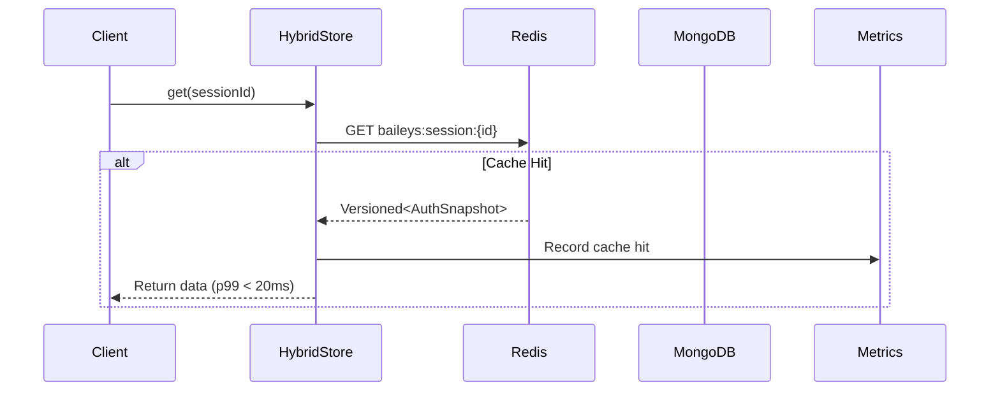
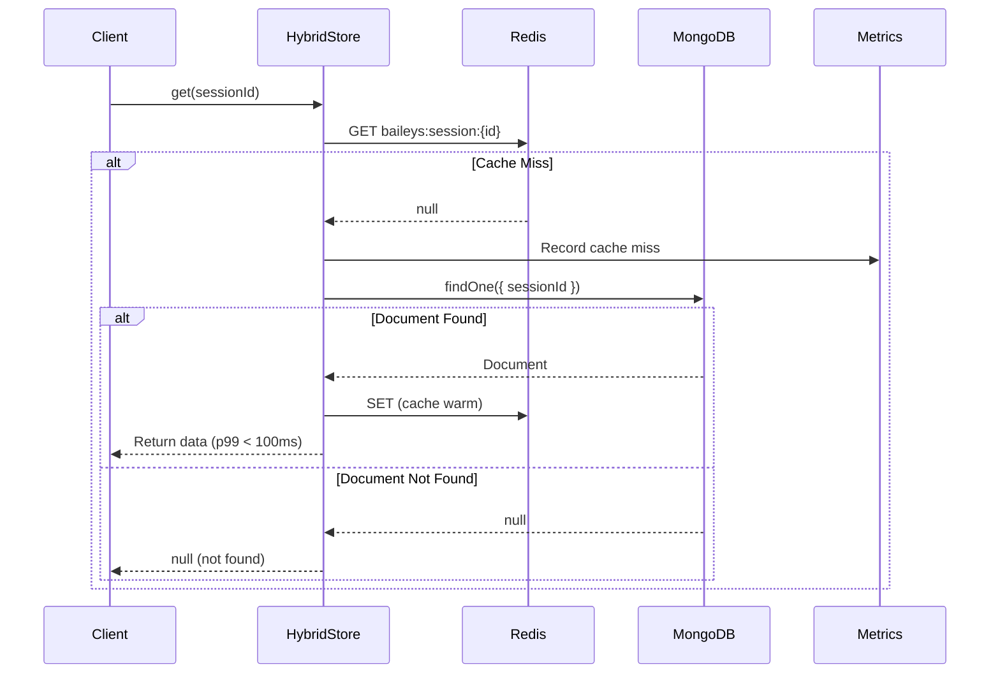
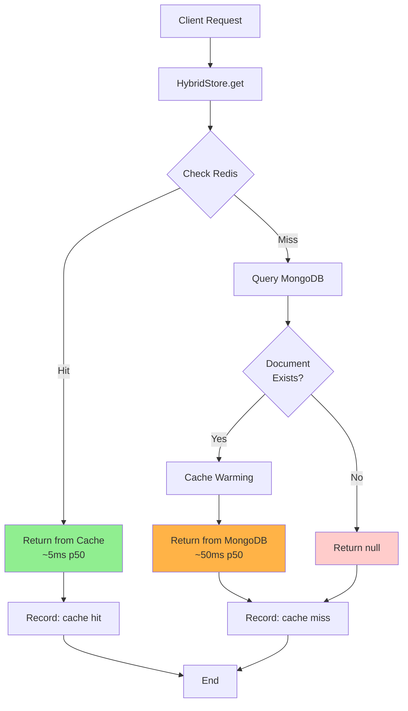

# Read Path - Cache Hit vs Miss

Diagrama de sequência detalhado do fluxo de leitura no Hybrid Storage.

## Sequence Diagram - Cache Hit (Fast Path)



## Sequence Diagram - Cache Miss (Cold Path)



## Combined Flow Diagram



## Performance Characteristics

### Cache Hit (80%+ of requests)

- **p50**: < 5ms
- **p95**: < 10ms
- **p99**: < 20ms
- **Operation**: Redis GET only

### Cache Miss (~20% of requests)

- **p50**: ~50ms
- **p95**: ~80ms
- **p99**: < 100ms
- **Operations**: Redis GET + MongoDB findOne + cache warm

### Cache Warming Strategy

```typescript
// Automatic cache warming on miss
const data = await mongoStore.get(sessionId);
if (data) {
  await redisStore.set(sessionId, data, defaultTtl);
}
```

## Impact of Cache Hit Rate

| Cache Hit Rate | Avg Latency | p99 Latency | Throughput |
| -------------- | ----------- | ----------- | ---------- |
| 50%            | 35ms        | 70ms        | 500 ops/s  |
| 70%            | 25ms        | 50ms        | 700 ops/s  |
| 80%            | 18ms        | 40ms        | 1000 ops/s |
| 90%            | 12ms        | 25ms        | 1200 ops/s |
| 95%            | 8ms         | 20ms        | 1500 ops/s |

**Target**: 80%+ cache hit rate for optimal performance.

## Circuit Breaker Integration

When MongoDB circuit breaker is OPEN:

- Cache hit path: ✅ Works normally
- Cache miss path: ⚠️ Returns cached data from Redis (potentially stale)

This allows graceful degradation with Redis-only mode.

---

**Próximos Diagramas:**

- [Write Path](./write-path.md)
- [Circuit Breaker States](./circuit-breaker.md)
- [Data Consistency Model](./data-consistency.md)
