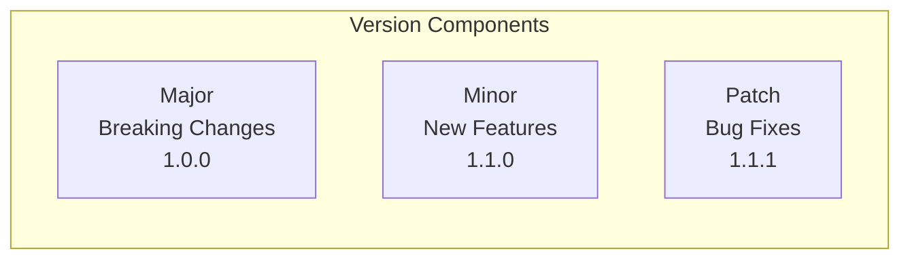
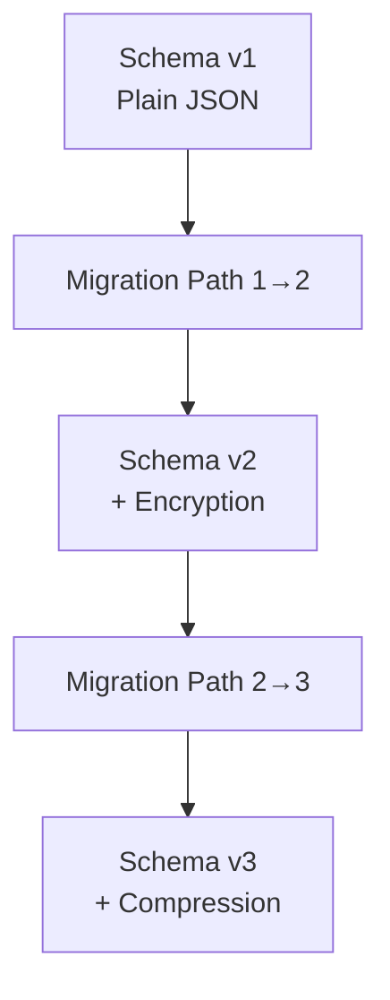
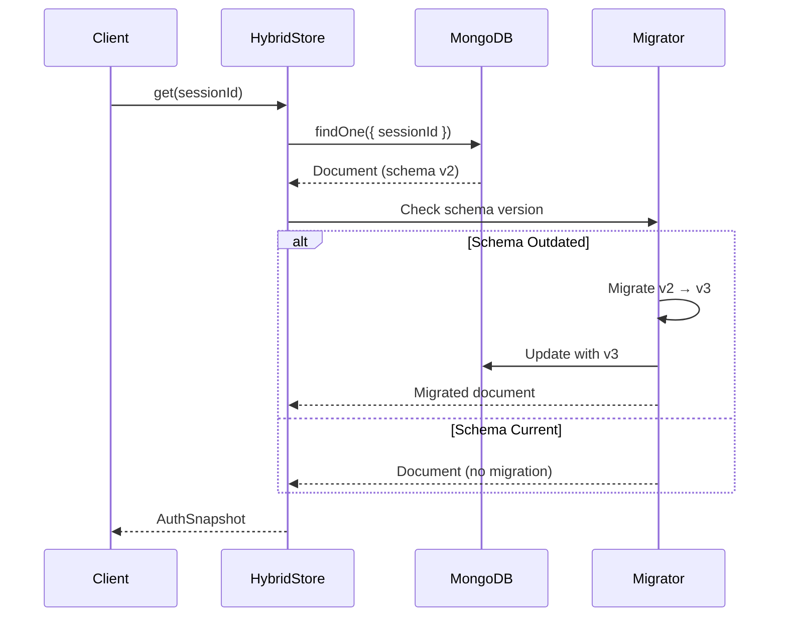
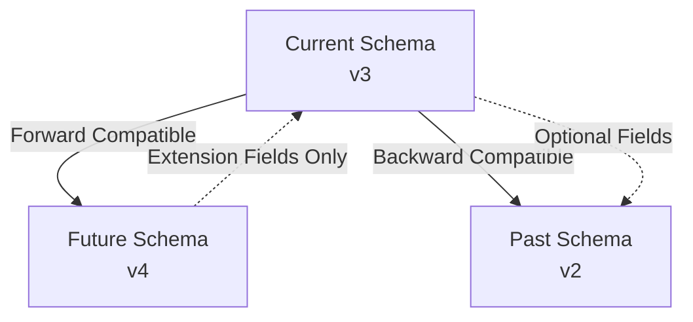
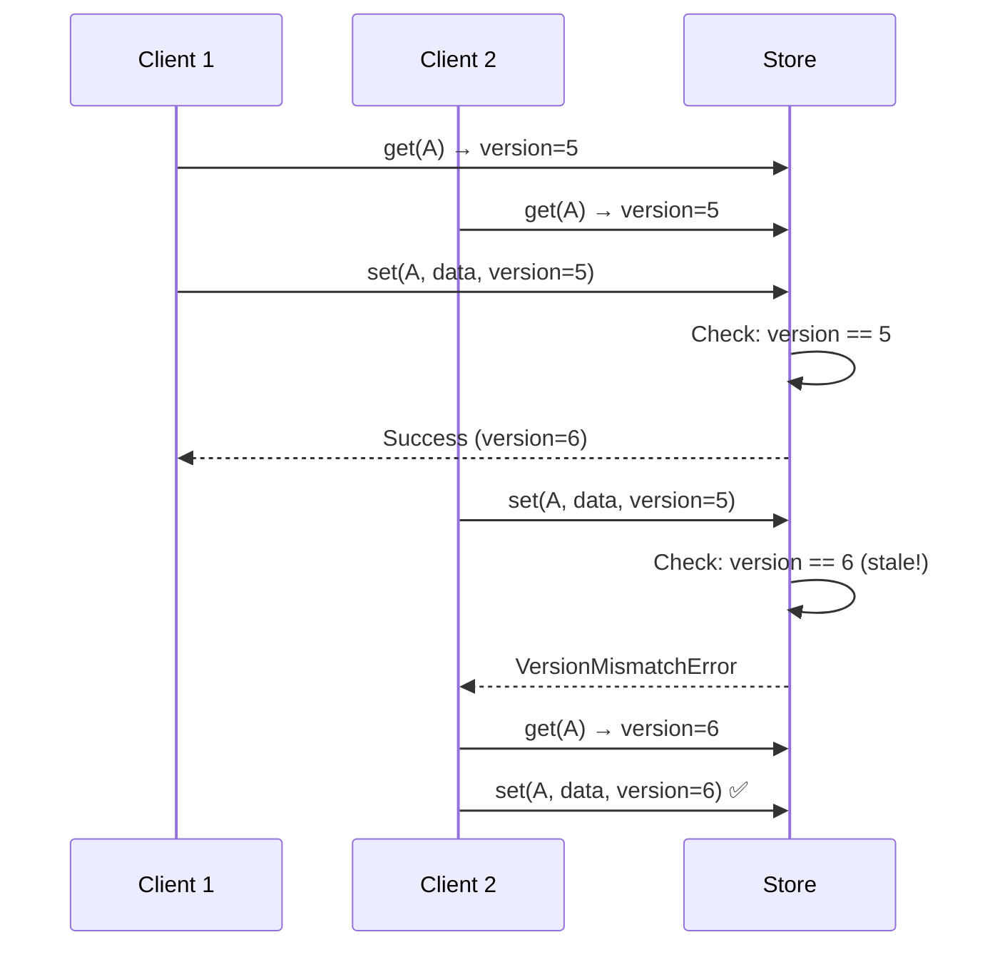
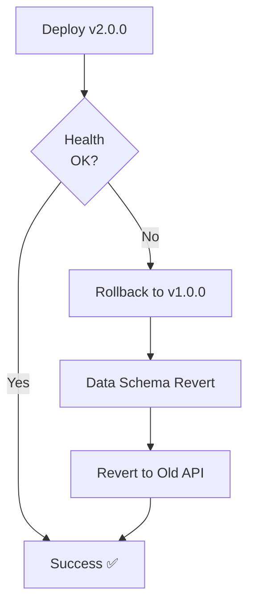

# Versioning Strategy

Estratégia de versionamento para compatibilidade e migration de dados.

## Version Schema



## Data Schema Versioning

### Schema Evolution



### Document Structure

```typescript
interface VersionedDocument {
  _id: string; // MongoDB _id
  sessionId: string; // Baileys session ID
  version: number; // Optimistic locking version
  schemaVersion: number; // Data schema version (v1, v2, v3)
  data: EncryptedSnapshot; // Encrypted auth snapshot
  metadata: {
    createdAt: number;
    updatedAt: number;
    ttl: number;
  };
}
```

## Migration Strategy

### On-Read Migration



### Migration Paths

```typescript
// Migration from v1 to v2 (add encryption)
async function migrateV1ToV2(v1Doc: V1Document): Promise<V2Document> {
  const encrypted = await codec.encrypt(v1Doc.data, masterKey);
  return {
    ...v1Doc,
    schemaVersion: 2,
    data: encrypted,
    metadata: {
      ...v1Doc.metadata,
      migratedAt: Date.now(),
    },
  };
}

// Migration from v2 to v3 (add compression)
async function migrateV2ToV3(v2Doc: V2Document): Promise<V3Document> {
  const compressed = await compress(v2Doc.data);
  return {
    ...v2Doc,
    schemaVersion: 3,
    data: compressed,
    metadata: {
      ...v2Doc.metadata,
      migratedAt: Date.now(),
    },
  };
}
```

## Forward and Backward Compatibility



## Version Locking

### Optimistic Locking



## Compatibility Matrix

| Operation         | v1→v2           | v2→v3           | v3→v4           |
| ----------------- | --------------- | --------------- | --------------- |
| **Read**          | ✅ Auto-migrate | ✅ Auto-migrate | ✅ Auto-migrate |
| **Write**         | ✅ Compatible   | ✅ Compatible   | ✅ Compatible   |
| **Backward Read** | ⚠️ Manual       | ⚠️ Manual       | ✅ Compatible   |

## API Versioning

### Semver Strategy

- **MAJOR**: Breaking changes (require code updates)
- **MINOR**: New features (backward compatible)
- **PATCH**: Bug fixes (backward compatible)

### Breaking Changes

```typescript
// v1.0.0
function createHybridStore(config: HybridConfigV1): HybridStore;
interface HybridConfigV1 {
  redisUrl: string;
}

// v2.0.0 (BREAKING)
function createHybridStore(config: HybridConfigV2): HybridStoreV2;
interface HybridConfigV2 {
  storage: { redisUrl: string; mongoUrl: string };
}
```

## Rollback Strategy



---

**Related Documentation:**

- [Architecture](./architecture.md)
- [Error Codes](../ERROR_CODES.md)
