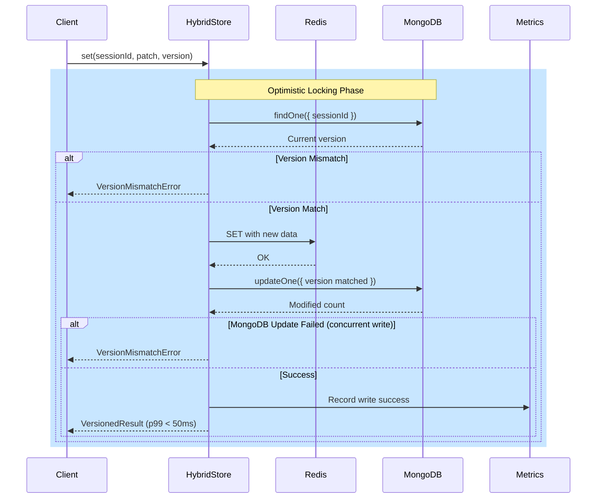
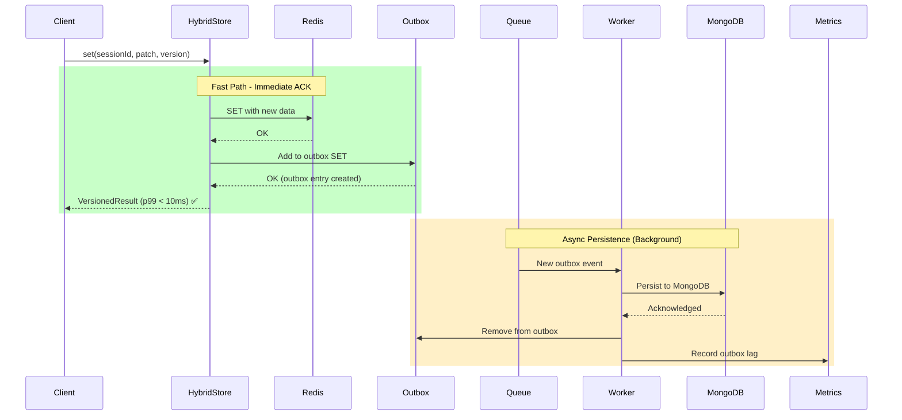
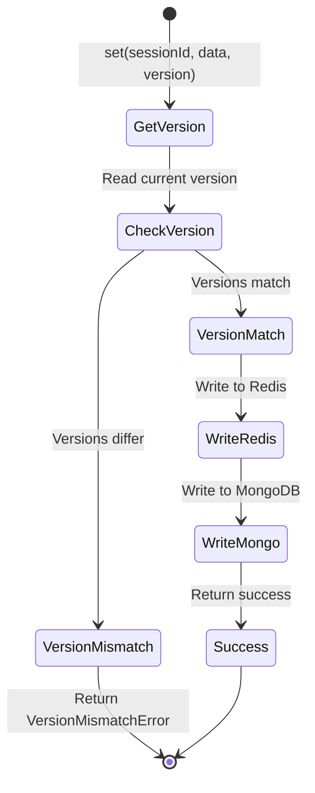
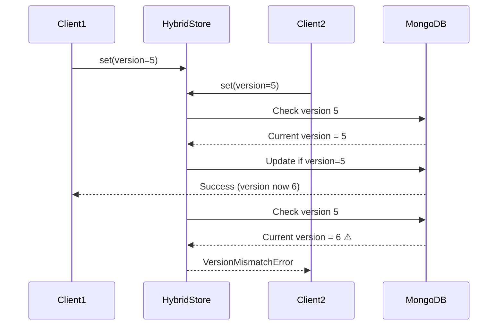

# Write Path - Sync vs Async Mode

Diagramas de sequência do fluxo de escrita no Hybrid Storage.

## Sequence Diagram - Sync Mode (Write-Through)



## Sequence Diagram - Async Mode (Write-Behind)



## Combined Flow Diagram

```mermaid
flowchart TD
    Start[Client Write Request] --> Mode{Write Mode?}
    
    Mode -->|Sync| SyncPath[Sync Write Path]
    Mode -->|Async| AsyncPath[Async Write Path]
    
    SyncPath --> CheckVersion{Version<br/>Check}
    CheckVersion -->|Mismatch| Error1[VersionMismatchError]
    CheckVersion -->|Match| WriteRedis1[Write to Redis]
    WriteRedis1 --> WriteMongo1[Write to MongoDB]
    WriteMongo1 --> Success1[Return ACK<br/>~30ms p50]
    
    AsyncPath --> WriteRedis2[Write to Redis]
    WriteRedis2 --> AddOutbox[Add to Outbox]
    AddOutbox --> AckFast[Return ACK<br/>~5ms p50] ✅
    
    AckFast --> Background[Background Worker]
    Background --> PersistMongo[Persist to MongoDB]
    PersistMongo --> ClearOutbox[Clear Outbox]
    
    Success1 --> End[End]
    AckFast --> End
    Error1 --> End
    ClearOutbox --> End
    
    style AckFast fill:#90EE90
    style Success1 fill:#87CEEB
    style Error1 fill:#FFCCCB
```

## Write Consistency Model

### Sync Mode (Strong Consistency)
- **Latency**: p99 < 50ms
- **Consistency**: Strong (both Redis + MongoDB)
- **Use Case**: Critical operations (creds update, keys update)

```typescript
// Sync write example
await store.set(sessionId, {
  creds: updatedCreds,
}, expectedVersion);
```

### Async Mode (Eventual Consistency)
- **Latency**: p99 < 10ms (immediate Redis)
- **Consistency**: Eventual (MongoDB lag < 1s)
- **Use Case**: High-frequency updates (appState, presence)

```typescript
// Async write example
const config = {
  ...preset,
  enableWriteBehind: true, // Enable async mode
};
```

## Optimistic Locking

### Version Check Flow


### Version Management
- **Version**: Incremental integer (0, 1, 2, ...)
- **Conflict Detection**: Compare expectedVersion with currentVersion
- **Retry Strategy**: Client handles retry on VersionMismatchError

## Outbox Pattern Details

### Outbox Entry Structure
```typescript
interface OutboxEntry {
  id: string;              // `${sessionId}:${version}`
  sessionId: string;
  patch: AuthPatch;
  version: number;
  fencingToken?: number;
  status: 'pending' | 'processing' | 'completed' | 'failed';
  createdAt: number;        // Unix timestamp
  updatedAt: number;
  attempts: number;
  lastError?: string;
  completedAt?: number;
}
```

### Outbox Reconciliation
- **Frequency**: Every 60 seconds
- **Scope**: All pending entries
- **Idempotence**: Version-based deduplication
- **TTL**: 7 days auto-cleanup

## Performance Comparison

| Metric | Sync Mode | Async Mode |
|--------|-----------|------------|
| p50 latency | ~20ms | ~5ms |
| p99 latency | ~50ms | ~10ms |
| Consistency | Strong | Eventual (RPO < 1s) |
| Throughput | 500 ops/s | 2000+ ops/s |
| Use Case | Critical updates | High-frequency updates |

## Error Handling

### Concurrent Write Conflict


### Recovery Strategy
```typescript
try {
  await store.set(sessionId, patch, expectedVersion);
} catch (error) {
  if (error instanceof VersionMismatchError) {
    // Retry with fresh version
    const current = await store.get(sessionId);
    await store.set(sessionId, patch, current.version);
  }
}
```

---

**Próximos Diagramas:**
- [Circuit Breaker States](./circuit-breaker.md)
- [Data Consistency Model](./data-consistency.md)
